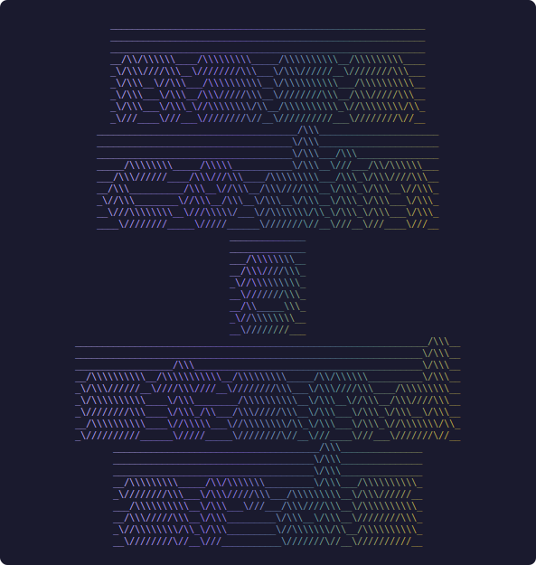
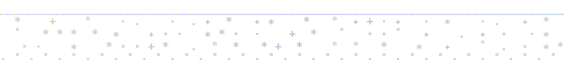
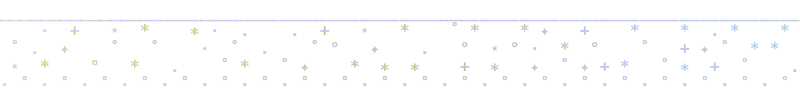
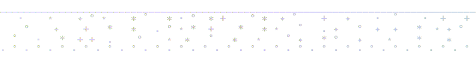
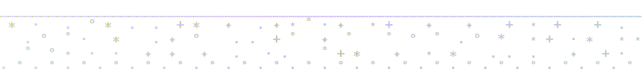
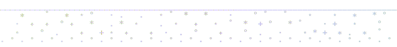
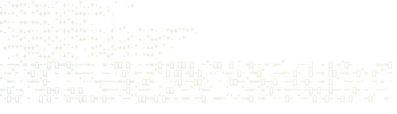

<p align="center">
  
</p>

<!-- add signature.svg to ./assets/ -->

<h1 align="center">nasa-coding-standards</h1>

<p align="center">a local skill and /nasa command for enforcing nasa's power of 10 on real code.</p>

<p align="center">
  
  
  
</p>

<p align="center">
  <a href="#what-it-does">what it does</a> · <a href="#install">install</a> · <a href="#usage">usage</a> · <a href="#whats-inside">what's inside</a>
</p>

<br>
<br>

<p align="center">
  
</p>

<br>
<br>

## what it does

this gives me two ways to run the same cleanup pass.

the `nasa-coding-standards/` skill handles the workflow. the `/nasa`
command makes it easy to aim that workflow at a file, a folder, or whatever
code is already in context.

built this because i wanted something stricter than a normal review pass.
small functions. bounded loops. fewer excuses.

<br>
<br>

<p align="center">
  
</p>

<br>
<br>

## install

```bash
git clone https://github.com/zaydiscold/nasa-coding-standards.git  # clone the repo
cd nasa-coding-standards                                           # move into it
mkdir -p ~/.claude/skills ~/.claude/commands                       # create local dirs
cp -R nasa-coding-standards ~/.claude/skills/                      # install the skill
cp .claude/commands/nasa.md ~/.claude/commands/                    # install the /nasa command
```

or

```bash
curl -L https://github.com/zaydiscold/nasa-coding-standards/archive/refs/heads/master.zip -o nasa-coding-standards.zip  # download zip
unzip nasa-coding-standards.zip                                                                                           # unpack it
cd nasa-coding-standards-master                                                                                           # move into it
mkdir -p ~/.claude/skills ~/.claude/commands                                                                             # create local dirs
cp -R nasa-coding-standards ~/.claude/skills/                                                                            # install the skill
cp .claude/commands/nasa.md ~/.claude/commands/                                                                          # install the /nasa command
```

if the app is already open, restart it after copying the files.

<br>
<br>

<p align="center">
  
</p>

<br>
<br>

## usage

the command path is direct.

```bash
/nasa src/main.c                           # audit one c file
/nasa src/api/users.ts                    # audit one ts file
/nasa src/lib/auth.ts src/lib/token.ts    # audit a small set of files
/nasa "the currently selected function"   # use the code already in context
```

the skill path is looser. mention `nasa`, `power of 10`, or `nasa coding
standards` and it should wake up on its own.

for c and c++, it uses the original jpl rules. for everything else, it uses
the adapted pass in `references/rules-interpreted.md`.

the output is always the same shape.

<sub>language detected. rule set applied. violation report. refactored code. change summary. verification.</sub>

<br>
<br>

<p align="center">
  
</p>

<br>
<br>

## what's inside

this repo is small on purpose.

- `nasa-coding-standards/SKILL.md` holds the actual skill instructions
- `nasa-coding-standards/references/rules-c.md` carries the original c rules
- `nasa-coding-standards/references/rules-interpreted.md` carries the adapted language rules
- `.claude/commands/nasa.md` gives the repo a real `/nasa` command
- `assets/` holds the readme visuals. banner, star fields, wisps

there's no extra packaging layer. just the files you need.

<br>
<br>

<p align="center">
  <a href="https://star-history.com/#zaydiscold/nasa-coding-standards&Date">
    <picture>
      <source media="(prefers-color-scheme: dark)" srcset="https://api.star-history.com/svg?repos=zaydiscold/nasa-coding-standards&type=Date&theme=dark" />
      <source media="(prefers-color-scheme: light)" srcset="https://api.star-history.com/svg?repos=zaydiscold/nasa-coding-standards&type=Date" />
      
    </picture>
  </a>
</p>

<p align="center">mit. <a href="./LICENSE">license</a></p>

<br>
<br>

<p align="center">
  
</p>

<br>
<br>

<p align="left"><strong>zayd / cold</strong></p>

<p align="center">
  <a href="https://zayd.wtf">zayd.wtf</a> · <a href="https://x.com/coldcooks">twitter</a> · <a href="https://github.com/zaydiscold">github</a>
  <br>
  <em>icarus only fell because he flew</em>
</p>

<p align="right">
  <strong>to do</strong><br>
  <sub>
  ☑ build the skill<br>
  ☑ add the /nasa command<br>
  ☐ add a packaged installer
  </sub>
</p>

<br>
<br>
<br>
<br>

<p align="center">
  
</p>
